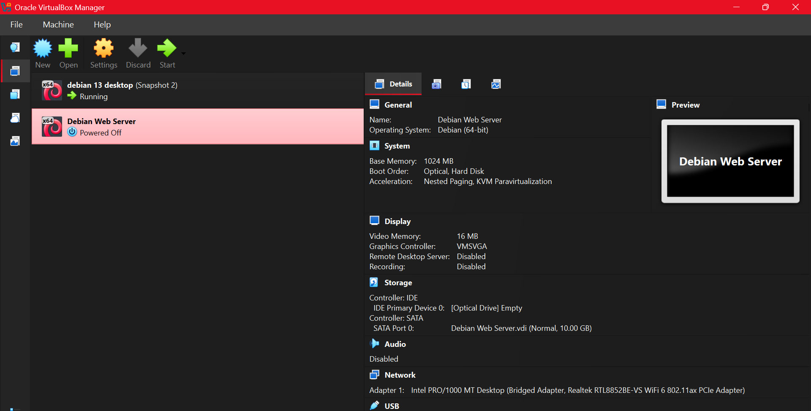
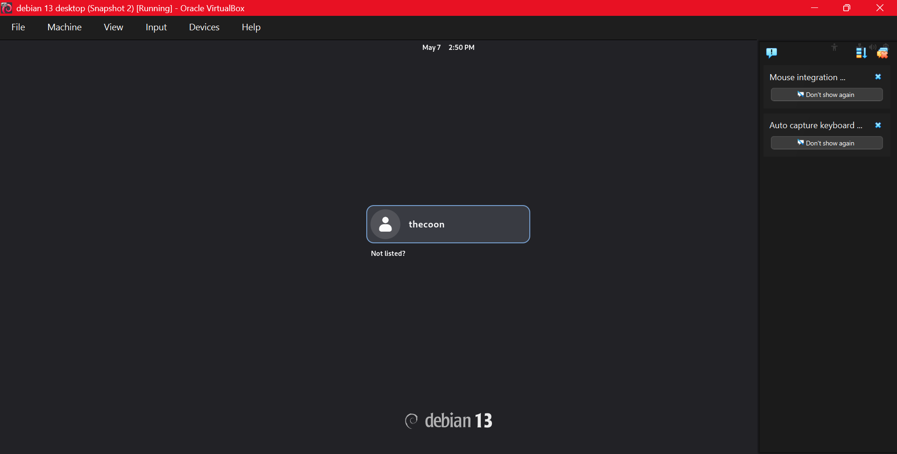
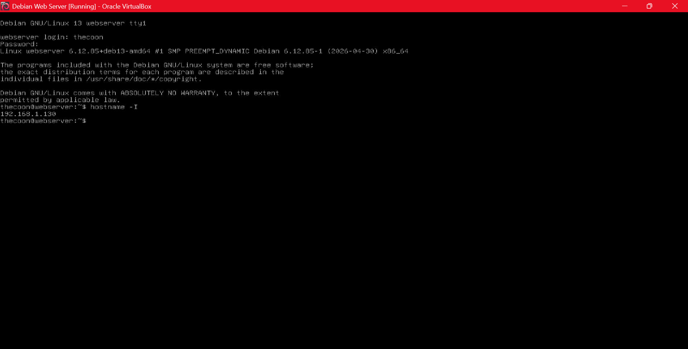
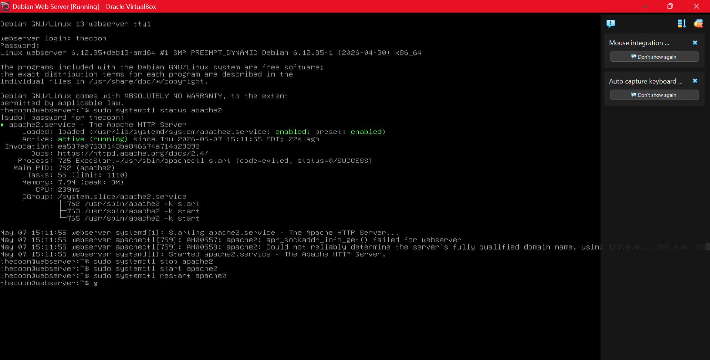

## Deliverable 2

#### What are the server hardware specifications (virtual machine settings)? Take a screenshot - don’t type it!

#### What is the Debian Login Screen? (Take screenshot - do not type it!)

#### What is the IP address of your Debian Server Virtual Machine? (type the command and show a screenshot of the commands output)

#### How do you work with the Firewall in Debian? (Type and explain what each command does)

`sudo ufw enable` - Used to enable a service.
`sudo ufw disable` - Used to disable a service.
`sudo ufw status` - Shows the status of a program.
`sudo ufw allow ssh` - Prevents you from getting locked out of your VM

#### How do you check if the Firewall is running?
- *To check if the Firewall is running, run `systemctl status ufw`*
- *This tells you whether it is active or not*

#### How do you disable the Firewall?
- *To disable the Firewall, run `sudo ufw disable`*
- *After running, `systemctl status ufw` will show the status as inactive.*

#### How do you add Apache to the Firewall?
- *To add Apache to the Firewall, run `sudo ufw allow 'Apache'`*
- *This allows Apache to serve web pages to anyone on the network.*

#### What different commands do we use to work with Apache? (Type and explain what each command does and include a screenshot!)

- `sudo systemctl status apache2` - Shows whether Apache is running or stopped.
- `sudo systemctl start apache2` - Starts the Apache web server.
- `sudo systemctl stop apache2` - Stops the Apache web server.
- `sudo systemctl restart apache2` - Restarts Apache.

#### What is the command you use to check if Apache is running?
- *To check if Apache is running, run `sudo systemctl status apache2`*
- *This tells you whether it is active or not*

#### What is the command you use to stop Apache?
- *To stop Apache, run `sudo systemctl stop apache2`*

#### What is the command you use to restart Apache?
- *To restart Apache, run `sudo systemctl restart apache2`*

#### What is the command used to test Apache configuration?
- *To test Apache Configuration, run `sudo apache2ctl configtest`*
- *This tests all configuration files for any errors*

#### What is the command used to check the installed version of Apache?
- *To check the installed version of Apache, run `apache2 -v`*
- *This shows you the current version and the build date*

#### What are some common configuration files for Apache?
- Some common configuration files for Apache are:
  - `apache2.conf`
  - `ports.conf`
  - `httpd.cong`

#### Where does Apache store logs?
- *Apache stores all of its logs in `/var/log/apache2/`*

#### What are some basic commands we can use to review logs?
- **Some basic commands to review logs are:**
  - `cat` - *Displays the contents of a file.*
  - `tac` - *Displays the contents of a file in reverse order.*
  - `head` - *Displays the first N lines of a file.*
  - `tail` - *Displays the last N lines file.*

