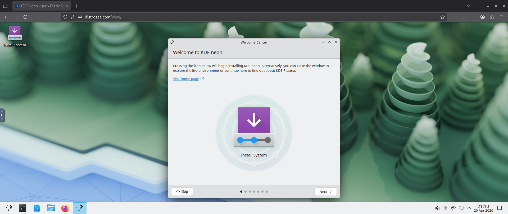
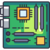

# Document 1

## What Linux Is
Linux is an open‑source operating system used on desktops, servers, mobile devices, and embedded systems. It is known for stability, security, and flexibility. With a variety of distributions available, each offers different tools and environments. Linux is widely used by developers, system administrators, cybersecurity professionals, and anyone who prefers a customizable system.

## Popular Linux Distributions

- Debian: A stable, community‑driven distribution known for reliability.

- Ubuntu: Beginner‑friendly and Debian based, with strong community support.

- Fedora: A distribution backed by Red Hat.

- Arch Linux: A rolling‑release distro for advanced users who want full control.

## Components of the Linux OS
| Component           | Description                                                                 |
|--------------------|-----------------------------------------------------------------------------|
| Bootloader         | Manages the boot process and loads the operating system.                    |
| Kernel             | The core of the OS; manages CPU, memory, and hardware.                      |
| Init System        | Starts user space and controls system services (daemons).                   |
| Daemons            | Background services for printing, sound, scheduling, networking, and more.  |
| Graphical Server   | Displays graphics on the monitor; often called the X server or X11.         |
| Desktop Environment| The user interface (GNOME, KDE, XFCE, etc.) with built‑in tools and apps.   |
| Applications       | Software installed on top of the desktop environment for daily use.         |

## Steps to Install a Linux Distro
1. Download an ISO
2. Create a bootable USB or VM  
3. Boot into the installer  
4. Follow installation prompts  
5. Reboot into your new system  

### Desktop Environments
GNOME:  

KDE Neon:  

### Linux Mascot

### Linux Distribution Logos
  
  

---

# Document 2

## Getting Started With Python
Python is a beginner‑friendly programming language used for automation, data work, scripting, and general software development. It focuses on readability and simple syntax, making it easy to learn for new programmers and powerful enough for advanced users. 

## Learn the Basics
Python code is written in plain text files ending in .py. The interpreter runs each line from top to bottom. Indentation is meaningful and defines code blocks.

## Hello, World!
A simple program that prints text to the screen: 
- `print("Hello, World!")`

## Variables and Types
Python creates variables when you assign values to them. Common types include integers, floats, strings, and booleans.

|   type   |   example   |
|----------|-------------|
| integer  |    x = 5    |
| float    |  pi = 3.14  |
| string   |   "hello"   |
| boolean  |    True     |

## Lists
Lists store ordered collections of items.
`colors = ["red", "green", "blue"]`

## Basic Operators
Python supports arithmetic `(+ - * / %)` and comparison operators 
`(== != > < >= <=)` used in expressions.

## String Formatting
You can insert variables into strings using f‑strings:

`name = "Dan"`
`print(f"Hello, {name}")`

## Basic String Operations
Basic String Operations allow you too inspect and modify strings.
`len(word)` - counts how many characters are in a string
`text[-1]` - Negative indexing accesses characters from the end of a string. `[-1]` being the last character.

## Conditions
Conditional statements let your program make decisions.

`if x > 10:
    print("Large")`
`else:
    print("Small")`

## Loops
Loops repeat actions.

`for i in range(3):
    print(i)`

---

# Document 3

## Table 1

| ID |      Name      |          Email          |     Investments      |                                                                
|----|----------------|-------------------------|----------------------|
|231 | Albert Master  | albert.master@gmail.com | Bonds                |
|210 | Alfred Alan    | aalan@gmail.com         | Stocks               |
|256 | Alison Smart   | asmart@biztalk.com      | Residential Property |
|211 | Ally Emery     | allye@easymail.com      | Stocks               |
|248 | Andrew Phipps  | andyp@mycorp.com        | Stocks               |
|234 | Andy Mitchel   | andym@hotmail.com       | Stocks               |
|226 | Angus Robins   | arobins@robins.com      | Bonds                |
|241 | Ann Milan      | ann_milan@iinet.com     | Residential Property |
|225 | Ben Bessel     | benb@hotmail.com        | Stocks               |
|235 | Benson Romanov | benr@albert.net         | Bonds                |

## Table 2

|Letter Grade|Percentage|
|------------|----------|
|     A      | 90-100%  |
|     B      | 80-89.99%|
|     C      | 70-79.99%|
|     D      | 60-69.99%|
|     F      |   <60%   |

## Table 3

|   Part   |   Name   |
|----------|-------------|
|| Graphics Card |
|| Hard Drive |
|| Motherboard |
||    RAM     |