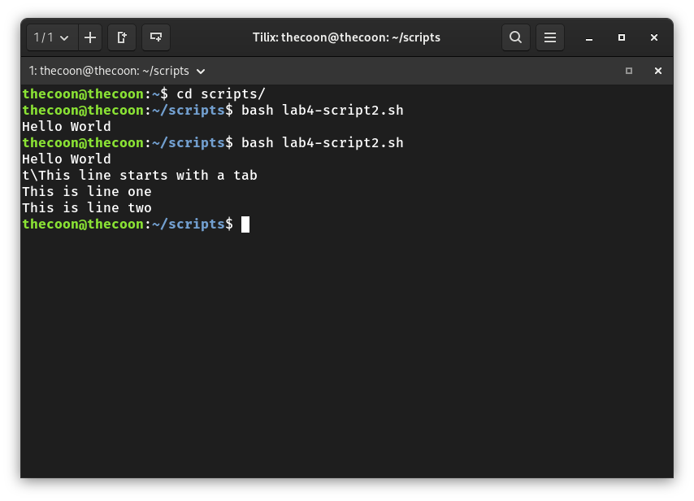

# Notes 4

## How to install and remove software using the APT command.

- To install and remove software using the APT command, you use the formula sudo + apt + package name.

## How to create a shell script step by step including screenshots and how to run it. Try to be as detailed as possible.

- To create a shell script, the first step is to create a folder where you can put all your scripts. After that, you open the text editor and create a file with the .sh file extension. In this file your first line will be the shell interpreter path #!/bin/bash. All code after this will run in the terminal after using cd to find the scripts folder, and bash to run it.

